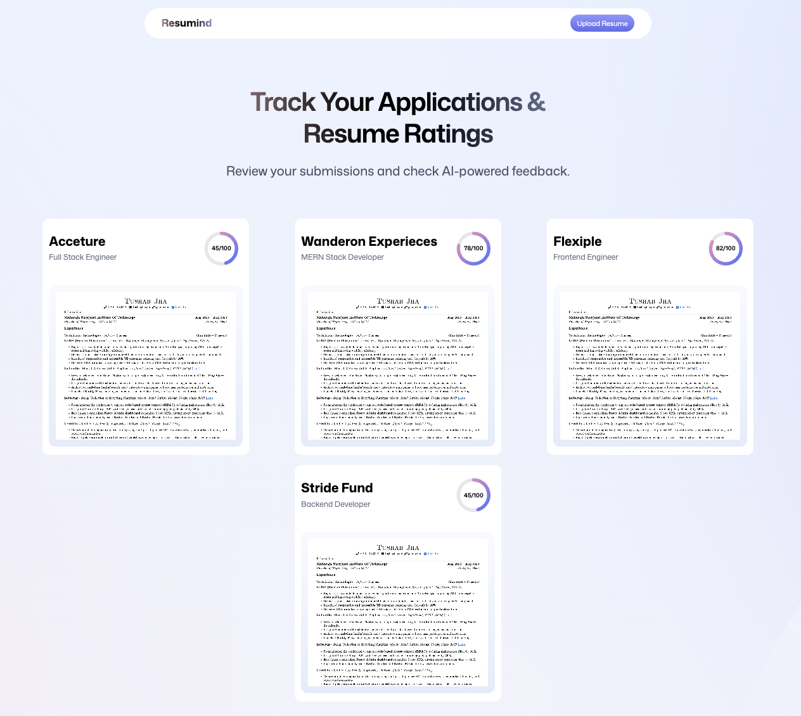
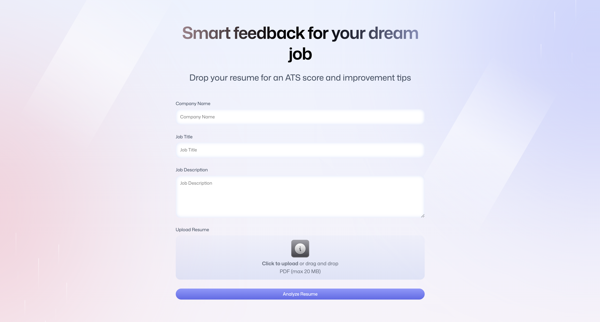
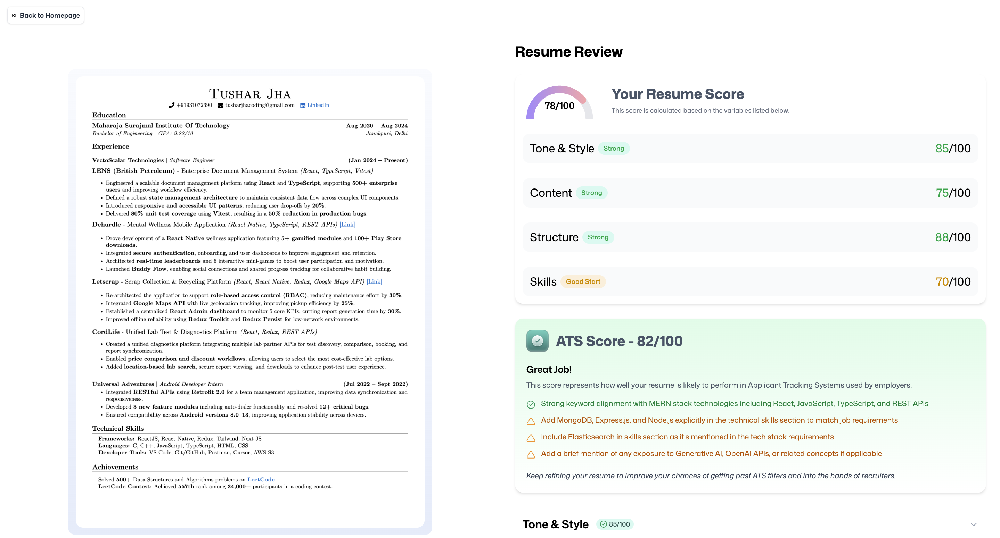
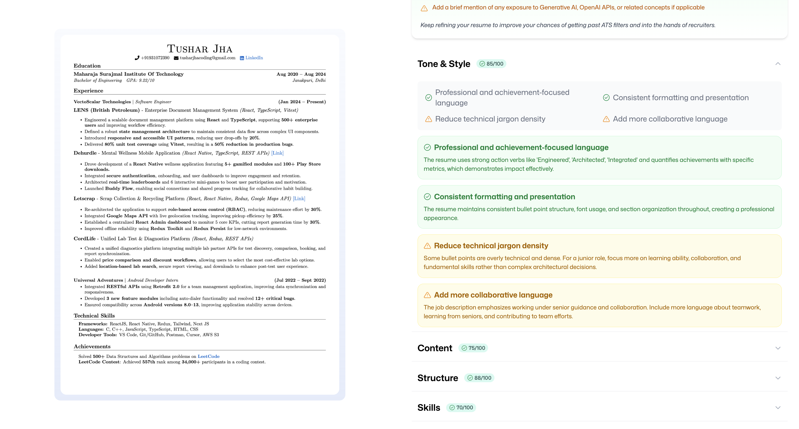
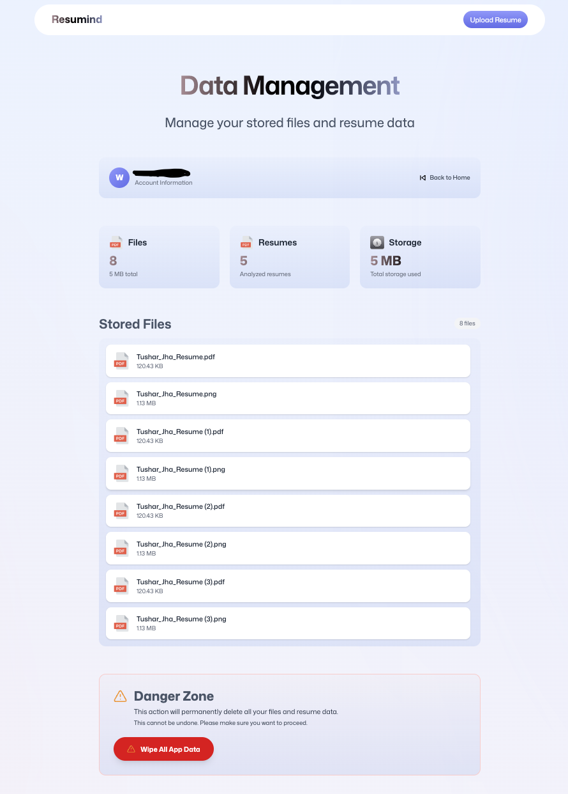

# Resumind - AI-Powered Resume Analyzer

<div align="center">


**Intelligent resume analysis powered by AI to help job seekers optimize their resumes for ATS systems and improve their chances of landing their dream job.**

[](https://react.dev/)
[](https://www.typescriptlang.org/)
[](https://reactrouter.com/)
[](https://tailwindcss.com/)

[Features](#-features) • [Tech Stack](#-tech-stack) • [Screenshots](#-screenshots) • [Setup](#-getting-started) • [Project Structure](#-project-structure)

</div>

---

## 📋 Table of Contents

- [About](#-about)
- [Problem Statement](#-problem-statement)
- [Features](#-features)
- [Screenshots](#-screenshots)
- [Tech Stack](#️-tech-stack)
- [Project Structure](#-project-structure)
- [Getting Started](#-getting-started)
- [Future Improvements](#-future-improvements)

---

## 🎯 About

**Resumind** is a modern web application that leverages artificial intelligence to provide comprehensive resume analysis and feedback. The platform helps job seekers understand how their resumes perform against Applicant Tracking Systems (ATS) and provides actionable insights to improve their chances of getting noticed by recruiters.

### Key Capabilities

- **ATS Compatibility Analysis**: Evaluates how well your resume will pass through automated screening systems
- **Multi-Dimensional Scoring**: Provides scores across 5 key areas: ATS compatibility, content quality, structure, skills alignment, and tone/style
- **Job-Specific Analysis**: Tailors feedback based on the specific job description and role you're applying for
- **Resume Tracking**: Maintain a portfolio of all your analyzed resumes with easy access to past feedback
- **Visual Feedback**: Interactive score visualizations and detailed improvement suggestions

---

## 💡 Problem Statement

Job seekers face several challenges when crafting resumes:

1. **ATS Compatibility**: Many resumes are rejected before human review due to poor ATS formatting
2. **Lack of Feedback**: No way to know what's wrong with a resume until rejection
3. **Generic Advice**: Most resume tips are generic and don't account for specific job requirements
4. **Time-Consuming**: Manual resume review and optimization is time-intensive

**Resumind solves these problems** by providing instant, AI-powered analysis that:

- Identifies ATS compatibility issues before submission
- Offers specific, actionable feedback tailored to your target role
- Saves time with automated analysis and scoring
- Tracks multiple resume versions for different applications

---

## ✨ Features

### Core Functionality

- 🔐 **User Authentication**: Secure login via Puter SDK
- 📄 **PDF Resume Upload**: Drag-and-drop interface with PDF validation
- 🖼️ **PDF to Image Conversion**: Automatic conversion for visual preview
- 🤖 **AI-Powered Analysis**: Comprehensive resume evaluation using advanced AI models
- 📊 **Multi-Category Scoring**:
  - Overall Resume Score (0-100)
  - ATS Compatibility Score
  - Content Quality Assessment
  - Structure & Formatting Analysis
  - Skills Alignment Evaluation
  - Tone & Style Review
- 💼 **Job-Specific Analysis**: Context-aware feedback based on job title and description
- 📈 **Resume Dashboard**: Track all analyzed resumes in one place
- 📝 **Detailed Feedback**: Expandable sections with specific improvement tips
- 🎨 **Modern UI/UX**: Clean, responsive design with smooth animations

### Advanced Features

- **Real-time Processing**: Live status updates during analysis
- **Persistent Storage**: All resumes and feedback saved securely
- **Visual Score Indicators**: Circular progress indicators and color-coded badges
- **Responsive Design**: Works seamlessly on desktop, tablet, and mobile devices

---

## 📸 Screenshots

### Dashboard View


_Main dashboard showing all analyzed resumes with overall scores_

### Upload Interface


_Resume upload form with job details input_

### Analysis Results


_Detailed feedback view with scores and improvement suggestions_

### Resume Detail View


_Side-by-side view of resume preview and detailed feedback_

### Wipe Data View


_Wipe Data to clear Resumes_

---

## 🛠️ Tech Stack

### Frontend

- **React 19.2.3** - Modern UI library with latest features
- **TypeScript 5.9.2** - Type-safe development
- **React Router 7.10.1** - Client-side routing and navigation
- **Tailwind CSS 4.1.13** - Utility-first CSS framework
- **Zustand 5.0.9** - Lightweight state management
- **React Dropzone 14.3.8** - File upload with drag-and-drop

### PDF Processing

- **PDF.js 5.4.530** - PDF rendering and conversion to images

### Backend & Services

- **Puter SDK** - Integrated backend services:
  - Authentication & user management
  - File storage and management
  - AI/ML model integration
  - Key-value database

### Development Tools

- **Vite 7.1.7** - Fast build tool and dev server
- **React Router Dev Tools** - Development utilities
- **TypeScript** - Static type checking


### Key Directories

- **`app/components/`**: Reusable UI components following React best practices
- **`app/routes/`**: Page-level components with route-specific logic
- **`lib/`**: Core business logic, integrations, and utilities
- **`constants/`**: Configuration and AI prompt templates
- **`public/`**: Static assets served directly
- **`types/`**: TypeScript type definitions for better IDE support

---

## 🚀 Getting Started

### Prerequisites

- **Node.js** 18+ and npm (or yarn/pnpm)
- **Puter Account** - Required for backend services (authentication, storage, AI)

### Installation

1. **Clone the repository**

   ```bash
   git clone https://github.com/yourusername/ai-resume-analyzer.git
   cd ai-resume-analyzer
   ```

2. **Install dependencies**

   ```bash
   npm install
   ```

3. **Set up Puter SDK**
   - The application uses Puter SDK for backend services
   - Ensure Puter SDK is properly configured in your environment
   - Authentication and API access will be handled through Puter

4. **Update PDF.js Worker** (if needed)
   ```bash
   npm install pdfjs-dist@latest
   cp node_modules/pdfjs-dist/build/pdf.worker.min.mjs public/pdf.worker.min.mjs
   ```

### Development

Start the development server:

```bash
npm run dev
```

The application will be available at `http://localhost:5173` (or the port specified by Vite).

### Building for Production

Create an optimized production build:

```bash
npm run build
```

The build output will be in the `build/` directory:

- `build/client/` - Static assets for client-side
- `build/server/` - Server-side code

### Running Production Build

```bash
npm start
```

### Type Checking

Run TypeScript type checking:

```bash
npm run typecheck
```

---

## 🔮 Future Improvements

### Planned Features

- [ ] **Export Functionality**: Download analysis reports as PDF
- [ ] **Resume Comparison**: Side-by-side comparison of multiple resume versions
- [ ] **Resume Templates**: Pre-built ATS-friendly templates
- [ ] **Cover Letter Analysis**: Extend AI analysis to cover letters
- [ ] **Interview Prep**: Generate potential interview questions based on resume
- [ ] **Analytics Dashboard**: Track resume performance over time
- [ ] **Multi-language Support**: Support for resumes in different languages
- [ ] **Resume Versioning**: Track changes and improvements across versions
- [ ] **Collaborative Features**: Share resumes with mentors or career counselors

### Technical Improvements

- [ ] **Performance Optimization**: Implement code splitting and lazy loading
- [ ] **Enhanced Error Handling**: Better error messages and recovery
- [ ] **Offline Support**: Service worker for offline functionality
- [ ] **Testing**: Add unit and integration tests
- [ ] **Accessibility**: Improve WCAG compliance
- [ ] **SEO Optimization**: Better meta tags and structured data

## 🙏 Acknowledgments

- [Puter](https://puter.com/) for providing backend infrastructure
- [PDF.js](https://mozilla.github.io/pdf.js/) for PDF processing capabilities
- [React Router](https://reactrouter.com/) team for the excellent routing framework
- [Tailwind CSS](https://tailwindcss.com/) for the utility-first CSS framework

---

<div align="center">

**Built with ❤️ using React, TypeScript, and AI**

⭐ Star this repo if you find it helpful!

</div>
